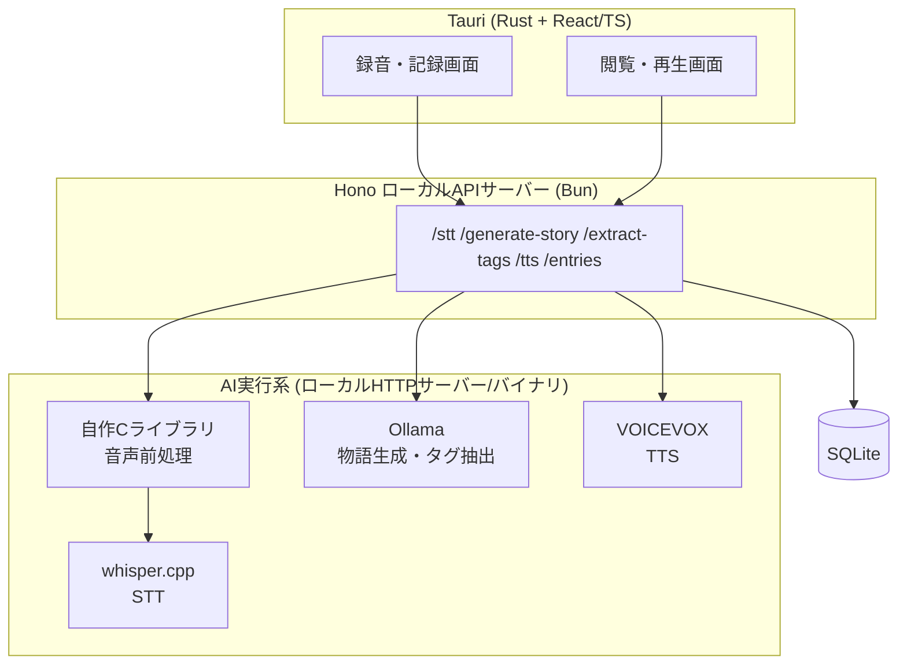

# LullDiary

> 話すだけで、今日という日が優しい物語になる。ローカル完結の音声日記アプリ。

音声(またはテキスト)で「今日あった出来事」を入力すると、ローカルLLMが寝る前の読み聞かせのような優しい物語に変換します。文章として読めるほか、TTSによる読み上げにも対応。処理はすべてローカルで完結し、外部にデータを送信しません。

## Concept

- **話すだけで日記になる**:音声入力で、書くハードルをなくす
- **物語として残る**:単なる記録ではなく、後で読み返したくなる短い物語に変換する
- **嫌なことがあった日も、ほっとする**:出来事をまず受け止めてから、優しい着地に導くプロンプト設計
- **プライバシー重視**:個人の記録を扱うため、STT・LLM・TTSすべてローカル処理

## Features (MVP)

- [x] 音声入力 / テキスト入力
- [x] ローカルLLMによる物語生成(読み聞かせ調)
- [x] 入力内容からのタグ抽出(対象者・シーン・感情・登場人物)
- [x] 生成物語の音声読み上げ(TTS)
- [x] 写真添付(任意・思い出を残したい日だけ)
- [x] 日記の一覧・閲覧

## Architecture



## Tech Stack

| レイヤー       | 技術                            | 選定理由                                                                                                                                                    |
| -------------- | ------------------------------- | ----------------------------------------------------------------------------------------------------------------------------------------------------------- |
| UIシェル       | Tauri (Rust + React/TypeScript) | Electronより軽量・省メモリ。Rustコアでファイル/マイクアクセスを安全に扱える。Tauri 2.0のモバイル対応で将来のスマホ展開も見据えられる                        |
| ローカルAPI    | Hono (Bun)                      | 軽量・高速起動。将来PCサーバー化する場合もそのままネットワーク公開できる                                                                                    |
| バリデーション | Zod                             | LLM出力(JSON)のスキーマ検証で堅牢性を担保                                                                                                                   |
| 音声前処理     | 自作Cライブラリ                 | 無音トリミング・簡易VAD・音量正規化を実装。バッファ操作やメモリ効率が求められる領域で、Cを選ぶ妥当性が説明しやすい。RustからFFI(`extern "C"`)経由で呼び出す |
| STT            | whisper.cpp                     | ローカルCPUでも実用的な速度・精度の日本語音声認識                                                                                                           |
| LLM            | Ollama (Gemma2 2B 等)           | ローカル完結。将来のスマホ単体動作を見据え、軽量モデルを優先検証                                                                                            |
| TTS            | VOICEVOX                        | 無料・ローカルで動作する、感情豊かな日本語音声合成                                                                                                          |
| DB             | SQLite (`bun:sqlite`)           | 追加依存なしでBunから直接利用可能                                                                                                                           |

## Why C?

音声の前処理(無音区間トリミング・簡易VAD・音量正規化)を自作のC言語ライブラリとして実装しています。音声・信号処理は伝統的にバッファ操作やメモリ効率が求められる領域であり、既存スタック(whisper.cppもC/C++実装)とも地続きで技術選定の妥当性が説明できるため、この部分にCを採用しました。RustのFFI(`extern "C"`)を介してTauriバックエンドから呼び出す構成です。

## Getting Started

> 詳細な手順は今後整備予定です。以下は想定するセットアップの概要です。

### Prerequisites

- [Bun](https://bun.sh/)
- [Rust](https://www.rust-lang.org/) / [Tauri CLI](https://tauri.app/)
- [Ollama](https://ollama.com/)(ローカルLLM実行)
- [VOICEVOX](https://voicevox.hiroshiba.jp/)(ローカルTTSエンジン)
- Cコンパイラ(gcc / clang 等、前処理ライブラリのビルド用)

### Setup

```bash
# 依存パッケージのインストール
bun install

# Cライブラリのビルド(前処理用共有ライブラリ)
cd native/audio-preprocess && make && cd ../..

# Ollamaでモデルを取得
ollama pull gemma2:2b

# VOICEVOXエンジンを起動(別プロセス)
# https://voicevox.hiroshiba.jp/ からダウンロードして起動

# 開発サーバー起動
bun run tauri dev
```

## Project Structure (予定)

```
lulldiary/
├── src/                 # React/TSフロントエンド
├── src-tauri/           # Tauri (Rust) バックエンド
├── native/
│   └── audio-preprocess/ # 自作Cライブラリ(音声前処理)
├── server/               # Hono (Bun) ローカルAPIサーバー
├── docs/
│   ├── requirements.md
│   ├── design-ui.md
│   ├── design-api.md
│   ├── design-ai.md
│   └── design-db.md
└── README.md
```

## Roadmap

| フェーズ      | 内容                                                                     |
| ------------- | ------------------------------------------------------------------------ |
| Phase 1 (MVP) | 音声/テキスト入力 → 物語生成+タグ抽出 → 文章表示+TTS再生、写真の任意添付 |
| Phase 2       | 蓄積された物語・タグデータをもとに、固定イラストの自動マッチング(挿絵化) |
| Phase 3       | スマホ単体でのオンデバイス動作(軽量モデルでの動作検証)                   |

詳細な要件・設計は [`docs/`](./docs) 以下の各ドキュメントを参照してください。

## License

TBD
